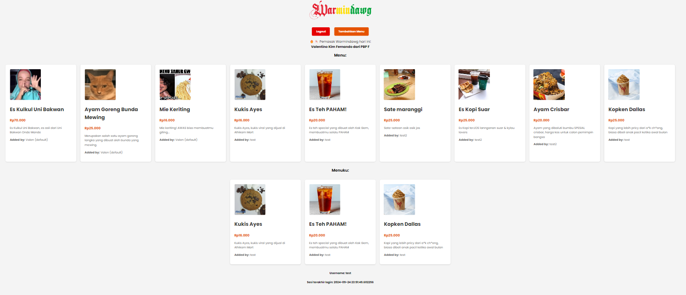
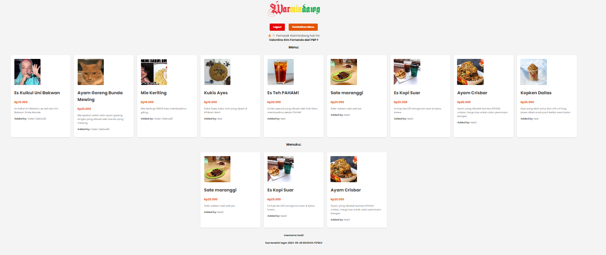
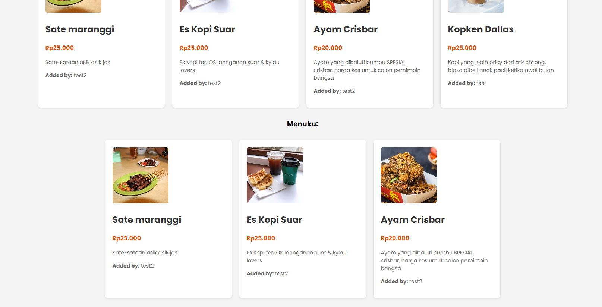

# Warmindawg (A Warmindo with extra spice 🌶️)
Warmindawg is a very simple app made with django

**Link:** [http://valentino-kim-warmindawg.pbp.cs.ui.ac.id/](http://valentino-kim-warmindawg.pbp.cs.ui.ac.id/)

# Jawaban Tugas Individu (Update: Tugas Individu 4)

**Nama**: Valentino Kim Fernando <br />
**NPM**: 2306275771 <br />
**Kelas**: PBP F 

<details>
    <summary><h2>Tugas Individu 2</h2></summary>

## 1. Jelaskan bagaimana cara kamu mengimplementasikan checklist di atas secara step-by-step (bukan hanya sekadar mengikuti tutorial).
Berikut merupakan bagian pengimplementasian web:
- Buat directory terlebih dahulu, lalu install requirements pada `requirements.txt `Membuat sebuah proyek django baru dengan melakukan `django-admin startproject e_commerce_pbp .`
- Lalu dilanjut dengan membuat app main dengan `python manage.py startapp main`
- Melakukan routing dengan mengonfigurasi URL pada app main lalu tidak lupa, dilanjut dengan mengonfigurasi URL pada `urls.py`
- Model dibuat pada `models.py` dengan attribute wajib yaitu name, price dan description dengan tipe masing-masing CharField, IntegerField, TextField
- Setelah itu kita melakukan migrasi model supaya project mudah untuk dilacak dengan `python manage.py makemigrations` lalu dilanjut dengan `python manage.py migrate`. Dengan ini direktori migrasi sudah dibuat di database local
- Dilanjut dengan membuat template HTML yang berisi barang-barang yang akan ditunjukan pada app
- Tidak lupa kita membuat function pada `views.py` supaya bisa mengisi tampilan yang diinginkan
- Sebelum deploy, kita tambahkan URL deployment PWS pada `settings.py` di bagian `ALLOWED_HOSTS`
- Selanjutnya app dideploy ke PWS --> `(pbp.cs.ui.ac.id)` 
- App bisa dipakai :D!

## 2. Buatlah bagan yang berisi request client ke web aplikasi berbasis Django beserta responnya dan jelaskan pada bagan tersebut kaitan antara urls.py, views.py, models.py, dan berkas html.
Bagan request-response dari client ke aplikasi Django:

   

## 3. Jelaskan fungsi git dalam pengembangan perangkat lunak!
Git berfungsi untuk version control dalam pengembangan perangkat lunak. Di antaranya:
- Git memungkinkan pelacakan dan manajemen perubahan kode sumber secara efisien.
- Git memfasilitasi kerja sama antar pengembang dengan menggunakan cabang (branches) untuk memisahkan perubahan.
- Dengan adanya branching, git mendukung eksperimen dan pengembangan fitur baru tanpa mengganggu kode utama.
- Git Mnyediakan backup penuh dari semua history kode, memudahkan dilakukannya pemulihan data.

## 4. Menurut Anda, dari semua framework yang ada, mengapa framework Django dijadikan permulaan pembelajaran pengembangan perangkat lunak?
Django menjadi framework awal yang dipelajari karena arsitekturnya yang terpadu, mudah digunakan (karena menggunakan python), mudah dibaca, serta memiliki struktur MVT (Model-View-Template) yang membantu memahami alur pengembangan web secara fundamental.

## 5. Mengapa model pada Django disebut sebagai ORM?
Model Django disebut ORM karena memetakan objek Python ke dalam tabel di database tanpa harus menulis query SQL secara langsung.
</details>

<details>
    <summary><h2>Tugas Individu 3</h2></summary>

## 1. Jelaskan mengapa kita memerlukan data delivery dalam pengimplementasian sebuah platform?
Data merupakan elemen penting yang memungkinkan aplikasi untuk berfungsi. 
Alasan kita memerlukan data delivery adalah:
- Responsivitas: Platform modern memerlukan pengiriman data real-time atau near real-time untuk memastikan responsivitas yang cepat terhadap input pengguna atau perubahan kondisi.
- Keamanan: Proses data delivery yang terstruktur dan terkontrol memungkinkan pengelolaan data yang aman
- Integrasi: Data delivery memungkinkan integrasi dengan berbagai sumber data, Data delivery memungkinkan pertukaran data yang konsisten dan efisien di antara sistem yang berbeda.

## 2. Menurutmu, mana yang lebih baik antara XML dan JSON? Mengapa JSON lebih populer dibandingkan XML?
Menurut saya sendiri JSON lebih baik, hal ini disebabkan karena beberapa hal:
- Lebih Ringkas dan Mudah Dibaca: JSON memiliki struktur yang lebih sederhana dan lebih ringkas daripada XML, yang membuatnya lebih mudah dibaca, intuitif dan mudah dipahami, bahkan oleh orang yang belum terbiasa melihat layout coding.
- Lebih Cepat Diproses: JSON lebih efisien untuk diparsing oleh browser atau server, sehingga mempercepat pengiriman dan pemrosesan data.

## 3. Jelaskan fungsi dari method `is_valid()` pada form Django dan mengapa kita membutuhkan method tersebut?
Method `is_valid()` pada form Django digunakan untuk memeriksa apakah data yang dikirimkan melalui form memenuhi semua aturan dan persyaratan validasi yang telah ditentukan. Fungsi ini penting karena:
- Data Validation: `is_valid()` memastikan bahwa semua field form diisi dengan benar, sesuai dengan tipe data yang diharapkan (misalnya, angka, teks, email, dll.), dan mematuhi aturan validasi lainnya (misalnya, panjang minimum/maksimum).

- Keamanan: Dengan memvalidasi data, kita dapat mencegah input berbahaya atau tidak valid yang dapat menyebabkan serangan, seperti SQL Injection atau Cross Site Scripting (XSS).

- Feedback ke Pengguna: Jika data tidak valid, Django dapat mengembalikan pesan kesalahan yang relevan, sehingga memberikan umpan balik yang berguna bagi pengguna untuk memperbaiki input mereka.

## 4. Mengapa kita membutuhkan `csrf_token` saat membuat form di Django? Apa yang dapat terjadi jika kita tidak menambahkan `csrf_token` pada form Django? Bagaimana hal tersebut dapat dimanfaatkan oleh penyerang?
`csrf_token` (Cross-Site Request Forgery token) diperlukan saat membuat form di Django untuk mencegah serangan CSRF. Serangan CSRF terjadi ketika seorang penyerang mengeksploitasi kredensial otentikasi pengguna tanpa sepengetahuan mereka dengan membuat mereka mengirim permintaan yang tidak sah ke situs web yang terotentikasi.

**Apa yang Dapat Terjadi Jika Tidak Ditambahkan?** Jika csrf_token tidak ditambahkan, penyerang dapat membuat HTTP request palsu atas nama pengguna yang telah terotentikasi, seperti mengirim formulir atau melakukan tindakan yang tidak diinginkan. Ini dapat mengakibatkan pencurian data atau pelanggaran hukum lainnya.

## 5. Jelaskan bagaimana cara kamu mengimplementasikan checklist di atas secara step-by-step (bukan hanya sekadar mengikuti tutorial).
Berikut merupakan cara saya mengimplementasikan tugas-tugas pada Tugas Individu 3:
- Pertama buatlah `forms.py` pada direktori main, dan diisi sesuai dengan model yang sudah kita buat sebelumnya
- Setelah itu, masuk ke `views.py` dan import forms, HTTPResponse, redirect dan juga serializers 
- Buatlah fungsi untuk menambahkan object baru dengan POST
- Sekarang buatlah page baru untuk forms dengan menambahkan file HTML baru pada directory templates, dalam project saya `add_menu.html`
- Jangan lupa untuk memasukkan `` dan button untuk submit form
- Kembali lagi ke `views.py` buatlah 4 fungsi untuk melihat data JSON dan XML. Pada project saya `menu_list_json`, `menu_list_xml`, `menu_details_json` dan `menu_details_xml`
- Setelah itu, masuk ke `urls.py` dan tambahkan route baru untuk menampilkan page forms, serta page untuk melihat database yang ditampilkan dalam JSON maupun XML
- Project sudah bisa dijalankan! :D

## Postman Documentation
`menu_list_json`:

`menu_list_xml`:

`menu_details_json`:

`menu_details_xml`:

</details>

<details open>
    <summary><h2>Tugas Individu 4</h2></summary>

## 1. Apa perbedaan antara `HttpResponseRedirect()` dan `redirect()`
Method `HttpResponseRedirect()` hanya bisa menerima `url` sebagai argumen pertamanya. Sementara itu, `redirect()` akan mengembalikan `HttpResponseRedirect` yang dapat menerima argumen berupa `model`, `view`, atau `url`.

## 2. Jelaskan cara kerja penghubungan model `Product` dengan `User`!
`Item` diberikan atribut ForeignKey ke `User`, yang menciptakan hubungan _Many-to-one_. `User` ini diambil dari package `django.contrib.auth.models`. Untuk melakukan _filtering_ pada object `Item`. Pada projek ini, ubah `models.py` menjadi berikut:
```py
from django.db import models
from django.contrib.auth.models import User

class Item(models.Model):
    user = models.ForeignKey(User, on_delete=models.CASCADE)
    name = models.CharField(max_length=100)
    price = models.IntegerField()
    description = models.TextField()
    image = models.CharField(max_length=255)

    def __str__(self):
        return self.name
```

## 3. Apa perbedaan antara _authentication_ dan _authorization_, apakah yang dilakukan saat pengguna login? Jelaskan bagaimana Django mengimplementasikan kedua konsep tersebut.
*** Authenthication ***
_Authentication_ merupakan proses untuk memverifikasi identitas seorang _user_, 

*** Authorization ***
_Authorization_ adalah proses untuk memverifikasi hak akses yang dimiliki _user_.

*** Pengimplementasian pada Django ***
Proses _Authentication_ di Django dikelola menggunakan _model_ `User` serta method bawaan seperti `login`, `logout`, dan `authenticate`. Di sisi lain, _Authorization_ pada Django dilakukan dengan memanfaatkan _decorators_ seperti `login_required()`, yang berfungsi membatasi akses hanya untuk _user_ yang telah terautentikasi.

## 4. Bagaimana Django mengingat pengguna yang telah login? Jelaskan kegunaan lain dari _cookies_ dan apakah semua _cookies_ aman digunakan?
Pertama, Ketika seorang pengguna berhasil login, Django menyimpan data _session_ di server, kemudian mengirimkan _cookie session_ ke browser pengguna. _Cookie_ ini berisi _ID session_ unik yang menghubungkan pengguna dengan _data session_ yang disimpan di server. Setiap kali pengguna mengirim _request_ baru ke server, _cookie_ ini dikembalikan ke server untuk memastikan bahwa pengguna tetap dikenali sampai mereka melakukan logout.

Visualisasi perjalanan _cookies_


*** Kegunaan lain _cookies_ ***
_Cookies_ digunakan untuk melacak preferensi dari _user_, mempersonalisasi konten—biasa digunakan pada _e-commerce_—, menampilkan iklan yang biasa kalian lihat pada website-website di internet.

*** Cookies digunakan untuk hal jahat ***
Tidak semua _cookies_ aman untuk digunakan. _Cookies_ yang tidak dilindungi enkripsi bisa rentan dicuri atau diakses oleh pihak ketiga, misalnya melalui serangan _XSS (Cross Site Scripting)_. Serangan _XSS_ dapat mengambil _cookie_-mu, hal ini berbahaya karena cookies bisa memberikan akses langsung ke situs web tanpa memerlukan proses login. Akibatnya, data-data penting dan juga informasi pribadimu dapat diakses oleh orang yang berhasil mendapatkan _cookie_.

## 5. Jelaskan bagaimana cara kamu mengimplementasikan _checklist_ di atas secara _step-by-step_ (bukan hanya sekadar mengikuti tutorial).
1. Pertama, membuat fungsi registrasi, login, logout 

*** Registrasi ***
- Pada `views.py`, import `UserCreationForm` dan `messages`. `UserCreationForm` memudahkan kita dalam membuat forms untuk pendaftaran pengguna.
- Tambahkan fungsi `register` pada `views.py`
```py
def register(request):
    form = UserCreationForm()

    if request.method == "POST":
        form = UserCreationForm(request.POST)
        if form.is_valid():
            form.save()
            messages.success(request, 'Your account has been successfully created!')
            return redirect('home:login')
    context = {'form':form}
    return render(request, 'register.html', context)
```
- Buatlah template `register.html` pada directory `main/templates` untuk menampilkan form
- Terakhir tambahkan path register pada `urls.py`
```py
urlpatterns = [
   ...
   path('register/', register, name='register'),]
```

*** Login ***
- Pada `views.py`, import `authenthicate`, `login` dan `AuthenticationForm`.
- Tambahkan fungsi `login_user` pada `views.py`
```py
def login_user(request):
   if request.method == 'POST':
      form = AuthenticationForm(data=request.POST)

      if form.is_valid():
            user = form.get_user()
            login(request, user)
            response = HttpResponseRedirect(reverse("home:show_home"))
            response.set_cookie('last_login', str(datetime.datetime.now()))
            return response

   else:
      form = AuthenticationForm(request)
   context = {'form': form}
   return render(request, 'login.html', context)
```
- Buatlah template `login.html` pada directory `main/templates` untuk menampilkan form
- Terakhir tambahkan path register pada `urls.py`
```py
urlpatterns = [
   ...
   path('login/', login_user, name='login'),]
```

*** Logout ***
- Pada `views.py`, import `logout`
- Tambahkan fungsi `logout_user` pada `views.py`
```py
def logout_user(request):
    logout(request)
    response = HttpResponseRedirect(reverse('home:login'))
    response.delete_cookie('last_login')
    return response
```
- Buatlah template `logout.html` pada directory `main/templates` untuk menampilkan form
- Terakhir tambahkan path register pada `urls.py`
```py
urlpatterns = [
   ...
   path('logout/', logout_user, name='logout'),]
```

2. Jangan lupa untuk me-restrict user untuk masuk ke home sebelum login, hal ini bisa dilakukan dengan:
- Buka `views.py` dan import `login_required`.
- Tambahkan decorator `@login_required(login_url='/login')` tepat di atas fungsi `show_home`.
```py
@login_required(login_url='/login')
def show_home(request):
```

3. Membuat dua akun pengguna dengan masing-masing tiga dummy data menggunakan model yang telah dibuat pada aplikasi sebelumnya untuk setiap akun di lokal.

Saya melakukan hal ini dengan meregister dengan langsung project saya di localhost dengan melakukan `py manage.py runserver`, lalu langsungkan fitur tambahkan akun. Saya membuat 2 akun, test & test2, lalu melancarkan fitur add menu dengan jumlah 3 menu ditambahkan. Berikut visualisasi tampilan kedua akun setelah menambahkan 3 menu untuk masing-masing akun:

layar user test


layar user test2


contoh closeup look test2


4. Menghubungkan Model dengan User
- Pada `models.py`, masukkan `from djang.contrib.auth.models import User`
- Pada `models.py`, tambahkan kode untuk `user`
```py
class Item(models.Model):
    user = models.ForeignKey(User, on_delete=models.CASCADE)
    name = models.CharField(max_length=100)
    price = models.IntegerField()
    description = models.TextField()
    image = models.CharField(max_length=255)

    def __str__(self):
        return self.name
```
- Lakukan migration dengan melancarkan `py manage.py makemigrations` lalu dilanjut `py manage.py migrate`.
- Buka `views.py`, kemudian ubah fungsi `add_menu_item` menjadi:
```py
def add_menu_item(request):
    form = MenuForm(request.POST or None)

    if form.is_valid() and request.method == "POST":
        item_entry = form.save(commit=False)
        item_entry.user = request.user
        item_entry.save()
        return redirect('/')
    
    return render(request, 'add_menu.html', {'form': form})
```

5. Menampilkan detail informasi pengguna yang sedang _logged in_ seperti _username_ dan menerapkan `cookies` seperti `last login` pada halaman utama aplikasi.
- Pada `views.py`, tambahkan import `import datetime`, `from django.http import HttpResponseRedirect`, dan `from django.urls import reverse`
- Pada fungsi `login_user`, ubah bagian `form.is_valid()`-mu menjadi seperti ini sehingga kamu bisa melihat kapan terakhir kali melakukan login
```py
...
if form.is_valid():
    user = form.get_user()
    login(request, user)
    response = HttpResponseRedirect(reverse("home:show_home"))
    response.set_cookie('last_login', str(datetime.datetime.now()))
    return response
...
```
- Pada fungsi `logout_user`, ubah kodemu menjadi seperti ini
```py
def logout_user(request):
    logout(request)
    response = HttpResponseRedirect(reverse('home:login'))
    response.delete_cookie('last_login')
    return response
```
- Pada fungsi `show_main`, tambahkan kode `'last_login': request.COOKIES['last_login']` ke dalam variabel `context`
- Tambahkan `last_login` ke dalam `home.html`
- Untuk melihat `username` sekaligus `last_login` pada home, buka `home.html` lalu tambahkan kode berikut:
```py
<h5>Username: {{ user.username }}</h5>
<h5>Sesi terakhir login: {{ last_login }}</h5>
```
Secara otomatis, Django akan mengambil username dari active user dan juga variabel last_login dari context pada fungsi `show_home`

- Website bisa dipakai :D
</details>