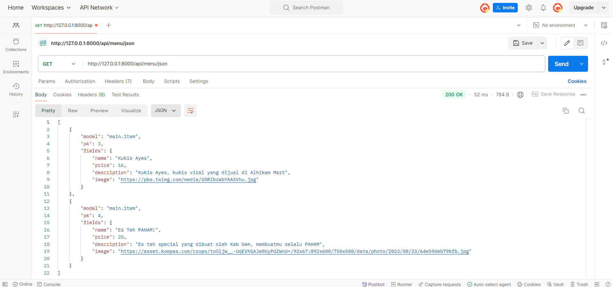
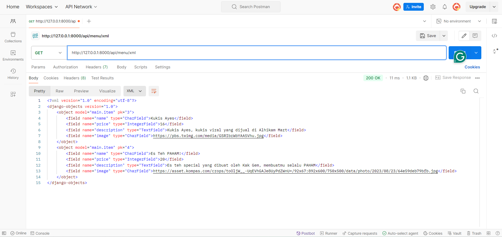
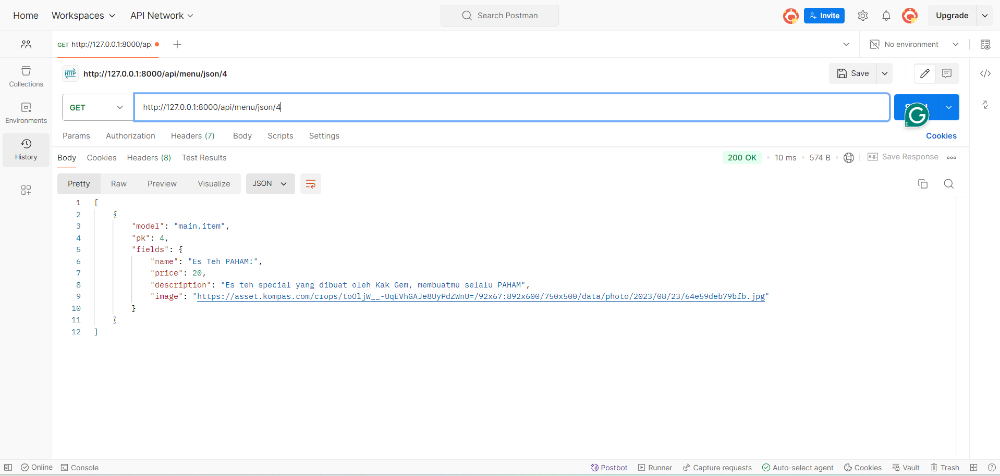
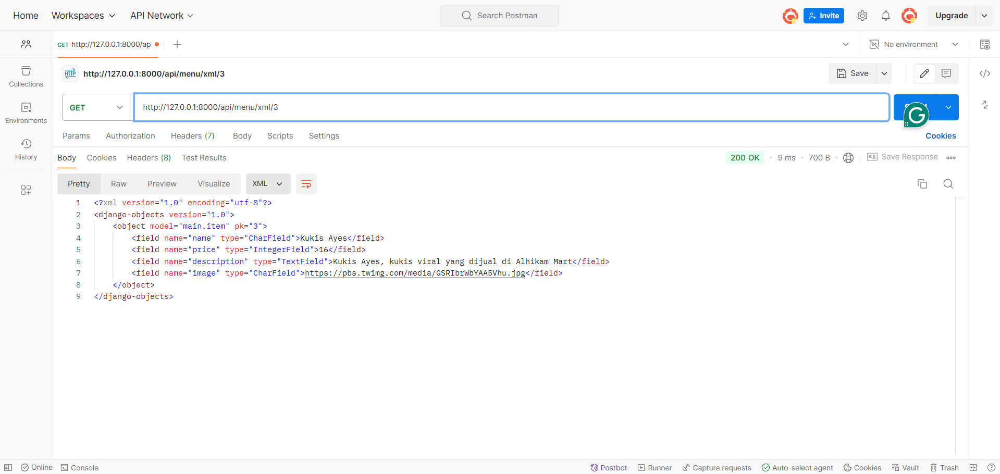

# Warmindawg (A Warmindo with extra spice 🌶️)
Warmindawg is a very simple app made with django

**Link:** [http://valentino-kim-warmindawg.pbp.cs.ui.ac.id/](http://valentino-kim-warmindawg.pbp.cs.ui.ac.id/)

# Jawaban Soal Tugas 2

**Nama**: Valentino Kim Fernando  
**NPM**: 2306275771  
**Kelas**: PBP F 

## 1. Jelaskan mengapa kita memerlukan data delivery dalam pengimplementasian sebuah platform?
Data merupakan elemen penting yang memungkinkan aplikasi untuk berfungsi. 
Alasan kita memerlukan data delivery adalah:
- Responsivitas: Platform modern memerlukan pengiriman data real-time atau near real-time untuk memastikan responsivitas yang cepat terhadap input pengguna atau perubahan kondisi.
- Keamanan: Proses data delivery yang terstruktur dan terkontrol memungkinkan pengelolaan data yang aman
- Integrasi: Data delivery memungkinkan integrasi dengan berbagai sumber data, Data delivery memungkinkan pertukaran data yang konsisten dan efisien di antara sistem yang berbeda.

## 2. Menurutmu, mana yang lebih baik antara XML dan JSON? Mengapa JSON lebih populer dibandingkan XML?
Menurut saya sendiri JSON lebih baik, hal ini disebabkan karena beberapa hal:
- Lebih Ringkas dan Mudah Dibaca: JSON memiliki struktur yang lebih sederhana dan lebih ringkas daripada XML, yang membuatnya lebih mudah dibaca, intuitif dan mudah dipahami, bahkan oleh orang yang belum terbiasa melihat layout coding.
- Lebih Cepat Diproses: JSON lebih efisien untuk diparsing oleh browser atau server, sehingga mempercepat pengiriman dan pemrosesan data.

## 3. Jelaskan fungsi dari method `is_valid()` pada form Django dan mengapa kita membutuhkan method tersebut?
Method `is_valid()` pada form Django digunakan untuk memeriksa apakah data yang dikirimkan melalui form memenuhi semua aturan dan persyaratan validasi yang telah ditentukan. Fungsi ini penting karena:
- Data Validation: `is_valid()` memastikan bahwa semua field form diisi dengan benar, sesuai dengan tipe data yang diharapkan (misalnya, angka, teks, email, dll.), dan mematuhi aturan validasi lainnya (misalnya, panjang minimum/maksimum).

- Keamanan: Dengan memvalidasi data, kita dapat mencegah input berbahaya atau tidak valid yang dapat menyebabkan serangan, seperti SQL Injection atau Cross Site Scripting (XSS).

- Feedback ke Pengguna: Jika data tidak valid, Django dapat mengembalikan pesan kesalahan yang relevan, sehingga memberikan umpan balik yang berguna bagi pengguna untuk memperbaiki input mereka.

## 4. Mengapa kita membutuhkan `csrf_token` saat membuat form di Django? Apa yang dapat terjadi jika kita tidak menambahkan `csrf_token` pada form Django? Bagaimana hal tersebut dapat dimanfaatkan oleh penyerang?
`csrf_token` (Cross-Site Request Forgery token) diperlukan saat membuat form di Django untuk mencegah serangan CSRF. Serangan CSRF terjadi ketika seorang penyerang mengeksploitasi kredensial otentikasi pengguna tanpa sepengetahuan mereka dengan membuat mereka mengirim permintaan yang tidak sah ke situs web yang terotentikasi.

**Apa yang Dapat Terjadi Jika Tidak Ditambahkan?** Jika csrf_token tidak ditambahkan, penyerang dapat membuat HTTP request palsu atas nama pengguna yang telah terotentikasi, seperti mengirim formulir atau melakukan tindakan yang tidak diinginkan. Ini dapat mengakibatkan pencurian data atau pelanggaran hukum lainnya.

## 5. Jelaskan bagaimana cara kamu mengimplementasikan checklist di atas secara step-by-step (bukan hanya sekadar mengikuti tutorial).
Berikut merupakan cara saya mengimplementasikan tugas-tugas pada Tugas Individu 3:
- Pertama buatlah `forms.py` pada direktori main, dan diisi sesuai dengan model yang sudah kita buat sebelumnya
- Setelah itu, masuk ke `views.py` dan import forms, HTTPResponse, redirect dan juga serializers 
- Buatlah fungsi untuk menambahkan object baru dengan POST
- Sekarang buatlah page baru untuk forms dengan menambahkan file HTML baru pada directory templates, dalam project saya `add_menu.html`
- Jangan lupa untuk memasukkan `` dan button untuk submit form
- Kembali lagi ke `views.py` buatlah 4 fungsi untuk melihat data JSON dan XML. Pada project saya `menu_list_json`, `menu_list_xml`, `menu_details_json` dan `menu_details_xml`
- Setelah itu, masuk ke `urls.py` dan tambahkan route baru untuk menampilkan page forms, serta page untuk melihat database yang ditampilkan dalam JSON maupun XML
- Project sudah bisa dijalankan! :D

## Postman Documentation
`menu_list_json`:

`menu_list_xml`:

`menu_details_json`:

`menu_details_xml`:
